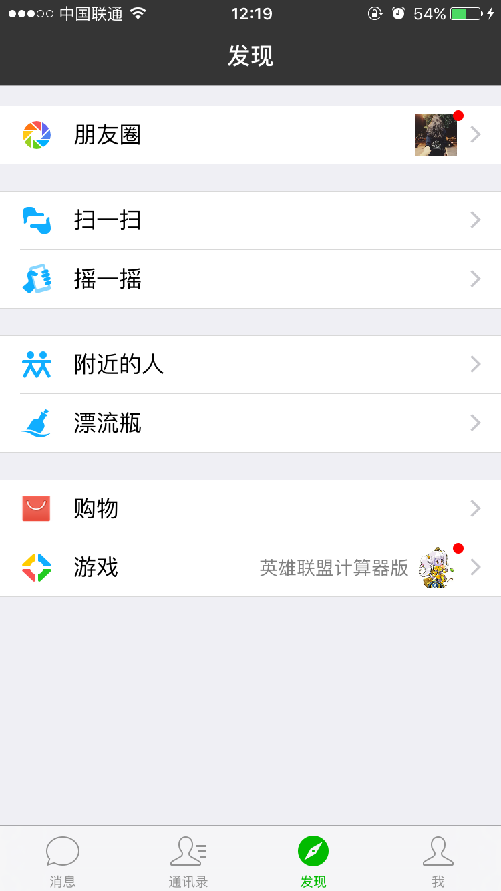
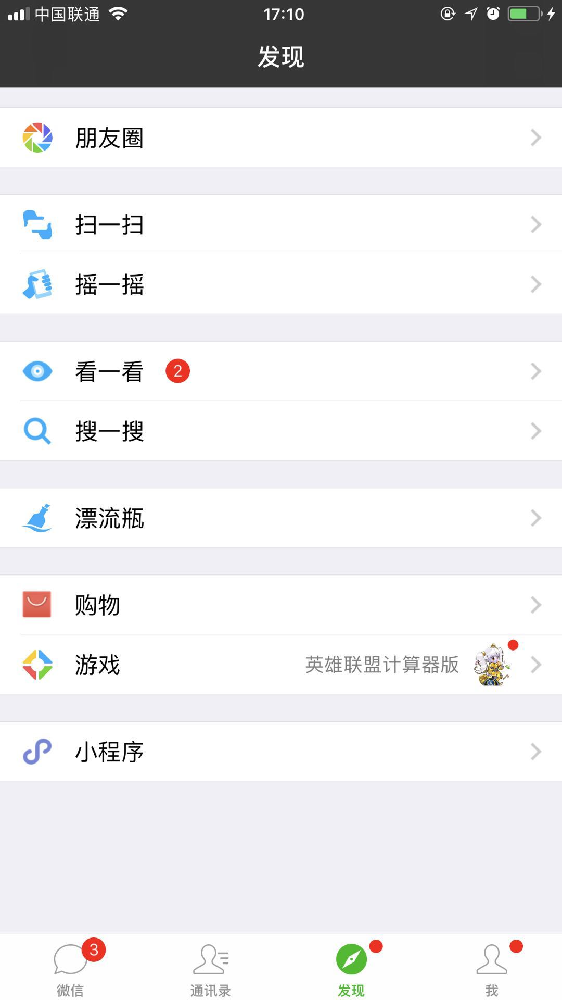

# TLChat

高仿微信，iOSAppTemplate代码重构。此版本TLChat基于[TLKit](https://github.com/tbl00c/TLKit)、 [ZZFLEX](https://github.com/tbl00c/ZZFLEX)实现.

  

  

 

## 近期计划
近期将对项目结构进行整理，将在代码层面的实现整个项目模块化，主要包含：

* 聊天界面重构，逻辑独立；
* 主要控制类逻辑整理；
* 主要列表使用ZZFLEX重构、以增加其拓展性；
* ZZFLEX对UIKit的一层封装，主要包含一个数据驱动的列表框架、和UIKit中常用控件的链式拓展，ZZFLEX相关资料正在整理中，目前已经开源；
* iOS11适配；
* 其它功能完善点。

## 已实现的功能
1. 消息界面
	* 消息列表（新会话加入，DB）
	* 消息侧滑删除
	* 好友搜索（支持模糊查询）
	* 更多菜单（可动态定制items）
2. 通讯录界面 
	* 好友列表（分组算法、DB）
	* 好友搜索
	* 好友资料（UI抽象模板），资料设置UI（使用设置类UI模板）
	* 新的朋友（读取手机联系人信息）
	* 群聊（UI，DB）
	* 标签（UI，逻辑）
3. 发现界面（使用菜单类UI模板）
	* 好友圈（整体架构，部分UI）
	* 扫一扫（UI，二维码扫描，条形码扫描）
	* 摇一摇UI
	* 漂流瓶UI
	* 购物、游戏（封装WebView）
4. 我界面（使用菜单类UI模板）
	* 个人信息（使用设置类UI模板）
	* 表情（UI、网络请求、下载、管理）
	* 设置（抽象设置类UI通用模板）
		* 字体大小
		* 聊天背景
		* 我的表情
		* 清空聊天记录
5. 聊天界面
	* 聊天输入框
	* 消息展示视图
		* 文字消息
		* 图片消息
		* 表情消息
		* 语音消息
	* 聊天键盘
		* 表情键盘（动态增删表情包）
		* 更多键盘
	* 聊天记录存储（DB）
	
## 计划中的功能
1. 聊天界面：视频消息
2. 聊天界面：地理位置消息
3. 好友圈：CoreText实现好友点赞、回复功能
4. 聊天模块抽离
		
## 项目主要使用的第三方库
* [Masonry](https://github.com/SnapKit/Masonry)：自动布局框架，简洁高效
* [FMDB](https://github.com/ccgus/fmdb)：sqlite数据库管理框架
* [AFNetworking](https://github.com/AFNetworking/AFNetworking)：网络请求
* [SDWebImage](https://github.com/rs/SDWebImage)：网络图片下载、缓存
* [MJExtension](https://github.com/CoderMJLee/MJExtension)：JSON - Model互转框架，高效低耦合
* [MJRefresh](https://github.com/CoderMJLee/MJRefresh)：下拉刷新，上拉加载更多，继承简单
* [CocoaLumberjack](https://github.com/CocoaLumberjack/CocoaLumberjack)：日志分级、本地化
* [MWPhotoBrowser](https://github.com/mwaterfall/MWPhotoBrowser)：图片选择器
* [SVProgressHUD](https://github.com/SVProgressHUD/SVProgressHUD)：进度提示框
